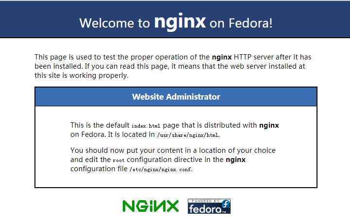

Nginx是2004年发布的一款高性能的HTTP反向代理服务器，它的特性是： [事件驱动](http://www.thegeekstuff.com/2013/11/nginx-vs-apache/) 、异步、非IO阻塞，它轻量、高性能、占用资源少、并发能力强。如果你有一下需求，可以选择Nginx：

- 需要服务单个高流量的网站
- 愿意处理一些高级配置和调整
- 想要使用比较新的网页开发框架
- 想使用CGI/FastCGI的替代方案，例如WSGI
- 不介意较少的插件、组件或模块
- 不介意复杂一点的配置

<!--more-->

### 1.准备工作

使用Xshell 、 PowerShell  或者 Terminal  （Mac）等工具通过 SSH 连接服务器：

```shell
sudo su -
```
键入密码并获得root用户。

### 2.安装Nginx

首先，添加CentOS EPEL包来安装Nginx：

```shell
yum install epel-release
```

添加成功之后，就可以通过yum来安装Nginx了：

```shell
yum -y install nginx
```

然后启动Nginx：

```shell
service nginx start
```

通过浏览器访问服务器的80端口，可以看到Nginx启动成功。




### 3.创建网站

#### 新增目录

首先来创建一个网站的目录，以本机为例：

```shell
mkdir -p /var/www/nest/public_html
```

并且在这个目录里面添加一个示例用的index页面：

```shell
vi /var/www/nest/public_html/index.html
```

输入访问成功后要显示的结果：

```html
Hello world!
```

保存并关闭编辑，按 “esc” 退出编辑，按 “：” 并输入 “wq”，回车保存。

#### 更改权限

修改创建的网站目录权限，使得外界能够访问这个文件夹：

```shell
chmod 755 /var/www/nest/public_html
```

### 4.配置Nginx

在Apache服务器中使用虚拟主机来服务多个网站，而Nginx使用 server blocks  来代替。首先先来创建一个目录存放配置：

```shell
mkdir /etc/nginx/sites-available
```

#### 修改Nginx默认配置文件

首先打开配置文件，配置文件的位置可以从上面的截图看到，执行：

```shell
vim /etc/nginx/nginx.conf
```

键盘输入 “i”  即可以进行更改，首选去除原有的服务器，通过在一行前面添加 “#” 注释。

如：

```shell
#     server {
#        listen       80 default_server;
#        listen       [::]:80 default_server;
#        server_name  _;
#        root         /usr/share/nginx/html;

#        # Load configuration files for the default server block.
#        include /etc/nginx/default.d/*.conf;

#        location / {
#       } 

#        error_page 404 /404.html;
#            location = /40x.html {
#        }

#        error_page 500 502 503 504 /50x.html;
#            location = /50x.html {
#        }
#    }
```

然后在这之后添加：

```nginx
include /etc/nginx/sites-available/*.conf;
server_names_hash_bucket_size 64;
```

`include /etc/nginx/sites-available/*.conf;`  引入了  `/etc/nginx/sites-available/` 目录下的所有配置文件，因此只需要在对应目录新建配置即可， `server_names_hash_bucket_size 64;` 表示支持的 server name 总数 ，配置完成之后，保存并退出。

#### 新增配置

首先在  `/etc/nginx/sites-available/` 目录创建一个配置文件：

```
vi /etc/nginx/sites-available/nest.conf
```

接着配置一段 server block ：

```nginx
server {
   listen 80;
   server_name localhost;

   location / {
      root /var/www/nest/public_html;
      index index.html index.htm;
      try_files $uri $uri/ =404;
   }

   error_page 500 502 503 504 /50x.html;
   location = /50x.html {
      root html;
   }
}
```

保存并退出。

#### 配置描述

**listen:** 服务器启动的端口

**server_name:** 是指用来访问网站的域名，由于没有域名这里用的是localhost ， 也可以配置面向公用的域名和www域名，如:

```
server_name yourdomain.com www.yourdomain.com;
```

**root:** 网页所在根目录

```
root /var/www/nest/public_html;
```

**try_files:** 这里告诉服务器在没有找到指定文件时，显示404：

```
try_files $uri $uri/ =404;
```

#### 重启Nginx

```shell
service nginx restart
```

OK，通过浏览器访问服务器启动的端口可以看到Hello world!，若需要配置多个网站，可以通过上述方法再新增配置文件进行配置。


参考资料：[How to install and configure NGINX on CentOS 7](https://www.godaddy.com/garage/how-to-install-and-configure-nginx-on-centos-7/)