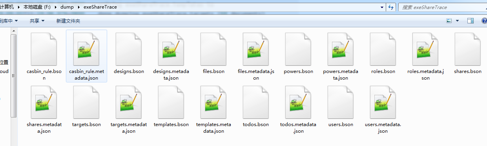

### 处理 MongoDB 远程数据库备份导出和导入

 #### 导出备份

```powershell
$ mongodump -h IP --port 端口 -u 用户名 -p 密码 -d 数据库 -o 文件存在路径
```

<!--more-->

- -h：服务器地址，不指定服务器地址和端口的话就是 `127.0.0.1:27017`
- -u：用户名
- -p：密码
- -d：需要备份的数据库（若不指定，则导出整个 MongoDB）
- -o：备份的数据存放的位置

下面是本人的备份输入：

```powershell
$ mongodump -h 服务器IP --port 端口 -u 用户名 -p 密码 -d exeShareTrace -o F:\dump
2019-09-05T11:19:05.922+0800    writing exeShareTrace.files to
2019-09-05T11:19:05.983+0800    writing exeShareTrace.targets to
2019-09-05T11:19:05.984+0800    writing exeShareTrace.users to
2019-09-05T11:19:05.984+0800    writing exeShareTrace.templates to
2019-09-05T11:19:06.076+0800    done dumping exeShareTrace.targets (68 documents)
2019-09-05T11:19:06.076+0800    writing exeShareTrace.shares to
2019-09-05T11:19:06.165+0800    done dumping exeShareTrace.shares (13 documents)
2019-09-05T11:19:06.165+0800    writing exeShareTrace.powers to
2019-09-05T11:19:06.253+0800    done dumping exeShareTrace.powers (4 documents)
2019-09-05T11:19:06.253+0800    writing exeShareTrace.roles to
2019-09-05T11:19:06.272+0800    done dumping exeShareTrace.templates (19 documents)
2019-09-05T11:19:06.272+0800    writing exeShareTrace.casbin_rule to
2019-09-05T11:19:06.282+0800    done dumping exeShareTrace.users (48 documents)
2019-09-05T11:19:06.282+0800    writing exeShareTrace.designs to
2019-09-05T11:19:06.290+0800    done dumping exeShareTrace.files (736 documents)
2019-09-05T11:19:06.290+0800    writing exeShareTrace.todos to
2019-09-05T11:19:06.341+0800    done dumping exeShareTrace.roles (4 documents)
2019-09-05T11:19:06.361+0800    done dumping exeShareTrace.casbin_rule (3 documents)
2019-09-05T11:19:06.369+0800    done dumping exeShareTrace.designs (2 documents)
2019-09-05T11:19:06.375+0800    done dumping exeShareTrace.todos (0 documents)
```

最终在电脑的 `F:\dump\exeShareTrace` 目录产生如下文件：



#### 备份导入

```powershell
$ mongorestore -h IP --port 端口 -u 用户名 -p 密码 -d 数据库 --drop 文件存在路径
```

--drop：先删除所有的数据再恢复，可选

下面是本人的恢复输入：

```powershell
$ mongorestore -h 服务器IP --port 端口 -u 用户名 -p 密码 -d exeShareTrace --drop F:\dump\exeShareTrace

2019-09-05T13:56:07.711+0800    the --db and --collection args should only be used when restoring from a BSON file. Other uses are deprecated and will not exist in the future; use --nsInclude instead
2019-09-05T13:56:07.750+0800    building a list of collections to restore from F:\dump\exeShareTrace dir
2019-09-05T13:56:07.855+0800    reading metadata for exeShareTrace.files from F:\dump\exeShareTrace\files.metadata.json
2019-09-05T13:56:07.930+0800    reading metadata for exeShareTrace.users from F:\dump\exeShareTrace\users.metadata.json
2019-09-05T13:56:07.985+0800    reading metadata for exeShareTrace.targets from F:\dump\exeShareTrace\targets.metadata.json
2019-09-05T13:56:08.038+0800    reading metadata for exeShareTrace.templates from F:\dump\exeShareTrace\templates.metadata.json
2019-09-05T13:56:08.104+0800    restoring exeShareTrace.templates from F:\dump\exeShareTrace\templates.bson
2019-09-05T13:56:08.161+0800    restoring exeShareTrace.files from F:\dump\exeShareTrace\files.bson
2019-09-05T13:56:08.238+0800    restoring exeShareTrace.users from F:\dump\exeShareTrace\users.bson
2019-09-05T13:56:08.240+0800    no indexes to restore
2019-09-05T13:56:08.240+0800    finished restoring exeShareTrace.templates (19 documents)
2019-09-05T13:56:08.288+0800    restoring exeShareTrace.targets from F:\dump\exeShareTrace\targets.bson
2019-09-05T13:56:08.349+0800    no indexes to restore
2019-09-05T13:56:08.350+0800    finished restoring exeShareTrace.users (48 documents)
2019-09-05T13:56:08.351+0800    reading metadata for exeShareTrace.shares from F:\dump\exeShareTrace\shares.metadata.json
2019-09-05T13:56:08.352+0800    reading metadata for exeShareTrace.powers from F:\dump\exeShareTrace\powers.metadata.json
2019-09-05T13:56:08.426+0800    restoring exeShareTrace.powers from F:\dump\exeShareTrace\powers.bson
2019-09-05T13:56:08.441+0800    restoring exeShareTrace.shares from F:\dump\exeShareTrace\shares.bson
2019-09-05T13:56:08.462+0800    no indexes to restore
2019-09-05T13:56:08.462+0800    finished restoring exeShareTrace.targets (68 documents)
2019-09-05T13:56:08.463+0800    reading metadata for exeShareTrace.designs from F:\dump\exeShareTrace\designs.metadata.json
2019-09-05T13:56:08.480+0800    no indexes to restore
2019-09-05T13:56:08.481+0800    finished restoring exeShareTrace.powers (4 documents)
2019-09-05T13:56:08.481+0800    reading metadata for exeShareTrace.roles from F:\dump\exeShareTrace\roles.metadata.json
2019-09-05T13:56:08.505+0800    no indexes to restore
2019-09-05T13:56:08.505+0800    finished restoring exeShareTrace.shares (13 documents)
2019-09-05T13:56:08.506+0800    reading metadata for exeShareTrace.casbin_rule from F:\dump\exeShareTrace\casbin_rule.metadata.json
2019-09-05T13:56:08.531+0800    restoring exeShareTrace.designs from F:\dump\exeShareTrace\designs.bson
2019-09-05T13:56:08.546+0800    restoring exeShareTrace.roles from F:\dump\exeShareTrace\roles.bson
2019-09-05T13:56:08.566+0800    restoring exeShareTrace.casbin_rule from F:\dump\exeShareTrace\casbin_rule.bson
2019-09-05T13:56:08.568+0800    no indexes to restore
2019-09-05T13:56:08.568+0800    finished restoring exeShareTrace.files (736 documents)
2019-09-05T13:56:08.568+0800    reading metadata for exeShareTrace.todos from F:\dump\exeShareTrace\todos.metadata.json
2019-09-05T13:56:08.584+0800    no indexes to restore
2019-09-05T13:56:08.584+0800    finished restoring exeShareTrace.designs (2 documents)
2019-09-05T13:56:08.598+0800    no indexes to restore
2019-09-05T13:56:08.599+0800    finished restoring exeShareTrace.roles (4 documents)
2019-09-05T13:56:08.612+0800    restoring indexes for collection exeShareTrace.casbin_rule from metadata
2019-09-05T13:56:08.630+0800    restoring exeShareTrace.todos from F:\dump\exeShareTrace\todos.bson
2019-09-05T13:56:08.636+0800    no indexes to restore
2019-09-05T13:56:08.636+0800    finished restoring exeShareTrace.todos (0 documents)
2019-09-05T13:56:08.708+0800    finished restoring exeShareTrace.casbin_rule (3 documents)
2019-09-05T13:56:08.709+0800    done
```

#### 连接远程MongoDB验证备份

```powershell
$ mongo -u 用户名 -p 密码 host:端口/数据库名
```

下面是本人的验证情况：

```powershell
$ mongo -u 用户名 -p 密码 IP地址:端口/exeShareTrace
MongoDB shell version v3.4.5
connecting to: mongodb://***.**.***.***:****/exeShareTrace
MongoDB server version: 4.0.12
WARNING: shell and server versions do not match
> show collections
casbin_rule
designs
files
powers
roles
shares
targets
templates
todos
users
> show dbs
exeShareTrace  0.000GB
> db.designs.find()
{ "_id" : ObjectId("5d6ce2d99b2c1d1e10c9327c"), "createDate" : ISODate("2019-09-02T09:36:26.717Z"), "updateDate" : ISODate("2019-09-02T09:36:26.717Z"), "elements" : [ { "_id" : ObjectId("5d6ce2d99b2c1d1e10c9327d"), "name" : "String", "type" : 1, "url" : "String", "text" : "String", "style" : "String" } ], "creator" : ObjectId("5d65338779745a1da8e21ac7"), "__v" : 0 }
{ "_id" : ObjectId("5d6ce2fd9b2c1d1e10c9327e"), "createDate" : ISODate("2019-09-02T09:36:26.717Z"), "updateDate" : ISODate("2019-09-02T09:36:26.717Z"), "elements" : [ { "_id" : ObjectId("5d6ce2fd9b2c1d1e10c93281"), "name" : "String", "type" : 1, "url" : "String", "text" : "String", "style" : "String" }, { "_id" : ObjectId("5d6ce2fd9b2c1d1e10c93280"), "name" : "String", "type" : 1, "url" : "String", "text" : "String", "style" : "String" }, { "_id" : ObjectId("5d6ce2fd9b2c1d1e10c9327f"), "name" : "String", "type" : 1, "url" : "String", "text" : "String", "style" : "String" } ], "creator" : ObjectId("5d65338779745a1da8e21ac7"), "__v" : 0 }
>
```

### 命令

`show collections` ： 用户有相应权限时，可以查看collection

`show dbs` ： 查看数据库列表

### 其它方式

#### `mongoexport` 导出表或表中部分字段

使用 MongoDB 自带命令来迁移数据，先导出集合数据再导入到数据库中

导出命令：`mongoexport`

语法：`mongoexport -d dbname -c collectionname -o filepath --type json/csv -f field`

```powershell
$ mongoexport -h IP --port 端口 -u 用户名 -p 密码 -d 数据库 -c 表名 -f 字段 -q 条件导出 --csv -o 文件名的具体路径(后缀格式可以是.dat或.csv)
```

- -d：数据库名
- -c：集合名称
- -o : 导出数据文件的路径
- -type : 导出数据类型，默认 json

#### `mongoimport` 导入表或表中部分字段

导入命令：`mongoimport`

语法：`mongoimport -d dbname -c collectionname --file filename --headerline --type json/csv -f field`

```powershell
# 还原整表导出的非csv文件
$ mongoimport -h IP --port 端口 -u 用户名 -p 密码 -d 数据库 -c 表名 --upsert --drop 文件名的具体路径 (--drop当不需要删除源文件可不加)

# 还原部分字段的导出文件
$ mongoimport -h IP --port 端口 -u 用户名 -p 密码 -d 数据库 -c 表名 --upsertFields 字段 --drop 文件名的具体路径 (--drop当不需要删除源文件可不加)

# 还原导出的csv文件（导出数据时如果不加--csv选项，导出的数据就会存在很多双引号，导入就会失败）
$ mongoimport -h IP --port 端口 -u 用户名 -p 密码 -d 数据库 -c 表名 --type 类型(csv) --headerline --upsert --drop 文件名的具体路径
```

- -d：数据库名
- -c：集合名称
- --file : 选择导入的文件
- -type : 文件类型，默认json
- -f : 字段，type为csv是必须设置此项

**注意：如果数据库存在数据，要导入最新的数据，则需要加 `--upsert` 选项，会更新数据，否则会报错(提示重复键错误收集)**